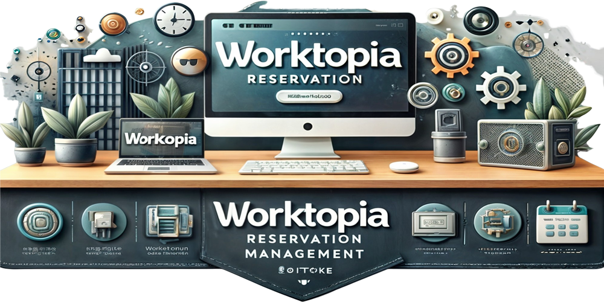

  

<h1>Proyecto Realizado por #Escadi y #Denox74</h1>  
Aplicación de escritorio desarrollada con JavaFX para la gestión de reservas de mesas de una oficina coworking.  
Permitiendo crear las reservas de los clientes recibiendo un Email de la reserva, juntos con sus registros, viendo visualmente si los horarios corespondiente a esa mesa que se quiere reservar esta ocupada o no y generando sus facturas correpondientes, pudiendo imprimir la misma.

---

## 🛠️ Tecnologías utilizadas

- **JavaFX** – Interfaz gráfica moderna para aplicaciones de escritorio.
- **MySQL** – Base de datos relacional para el almacenamiento estructurado de datos.
- **IntelliJ IDEA** – Entorno de desarrollo utilizado para la construcción del proyecto.

---

## 📦 Funcionalidades principales

- 📋 Registro y modificación de **Clientes** disponibles para adopción.
- 👥 Gestión de **Reservas**.
- 🏠 Administración de **Facturas y sus pagos**.
- 🔍 Búsqueda y filtrado de datos para facilitar el trabajo del personal.

---

## 📂 Estructura del proyecto
- Estructura realizada en MVC

